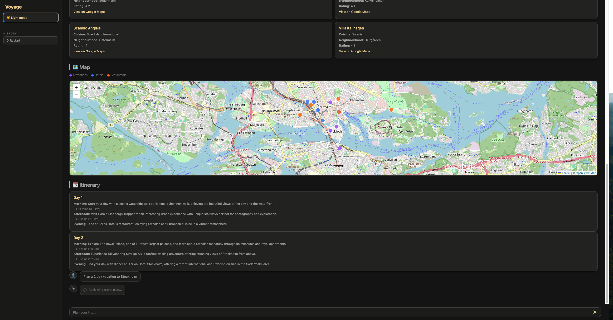
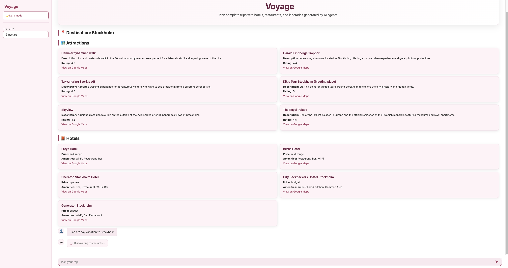

# Voyage — AI Trip Planner

**Live demo:** [https://voyage.jonathandorairaj.cloud/]

 

 

A multi-agent AI system that plans complete travel itineraries on demand. Submit a natural-language query and Voyage coordinates a pipeline of specialised AI agents to research the destination, find hotels and restaurants, build a day-by-day itinerary, and review the full plan — streaming each section to the UI as it finishes.

---

## How it works

Voyage runs five agents in sequence. Each agent has a defined role, a structured output schema, and access to specific tools. Results from earlier agents are passed as context into later ones.

```
User query
    │
    ▼
1. Destination Research Agent   → attractions, coordinates, descriptions
    │
    ▼
2. Hotel Planner                → hotel recommendations with amenities and pricing
    │
    ▼
3. Food Explorer                → restaurants, cuisines, neighbourhoods
    │
    ▼
4. Itinerary Planner            → day-by-day schedule with travel times between stops
    │
    ▼
5. Travel Plan Critic           → reviews and finalises the complete plan
    │
    ▼
  Structured output streamed to UI section by section
```

Each agent uses the [OpenAI Agents SDK](https://github.com/openai/openai-agents-python) with a `gpt-4.1-mini` model and Pydantic output types enforced via the SDK's `output_type` parameter.

---

## Features

- **Progressive streaming** — sections appear in the UI as each agent finishes, not all at once
- **Interactive map** — Leaflet.js map with colour-coded markers for attractions, hotels, and restaurants
- **Travel times** — Google Distance Matrix API estimates time between itinerary stops
- **PDF export** — download the full itinerary as a formatted PDF (ReportLab)
- **Trip history** — previous plans saved to localStorage and reloadable from the sidebar
- **Dark / light theme** — toggle persisted across sessions

---

## Tech stack

| Layer | Technology |
|---|---|
| Agent framework | OpenAI Agents SDK |
| Backend | FastAPI (Python 3.11) |
| Streaming | Server-Sent Events via `StreamingResponse` |
| Frontend | Vanilla HTML / CSS / JS |
| Map | Leaflet.js + OpenStreetMap |
| PDF | ReportLab |
| Infrastructure | Docker, Nginx, docker-compose |

---

## Project structure

```
├── app/
│   ├── main.py          # FastAPI app, routes, CORS
│   ├── agents.py        # Agent definitions and sequential pipeline
│   ├── schemas.py       # Pydantic output types for each agent
│   ├── tools.py         # search_places, travel_time, get_weather
│   ├── guardrails.py    # Input validation / banned topic filter
│   └── telemetry.py     # OpenTelemetry setup (traces + metrics)
│
├── frontend/
│   ├── pdf_export.py    # ReportLab PDF generator
│   ├── functions.py     # Streamlit rendering helpers (legacy)
│   └── styles.py        # Streamlit CSS (legacy)
│
├── html-frontend/
│   └── index.html       # Active frontend — standalone HTML/CSS/JS
│
├── streamlit_app.py     # Legacy Streamlit frontend (not deployed)
├── Dockerfile           # API container
├── docker-compose.yml   # API + Nginx services
└── requirements.txt
```

The active frontend is `html-frontend/index.html` — a single self-contained file served by Nginx. The Streamlit app (`streamlit_app.py`) is kept as a reference but is not part of the deployed stack.

---

## API endpoints

All routes are prefixed with `/api`.

### `POST /api/plan-trip-stream` — **production**

Streams the trip plan as newline-delimited JSON events using Server-Sent Events. Each event carries a `status` field and the data produced by that agent.

```
{"status": "researching"}
{"status": "research_done", "destination": "Tokyo", "attractions": [...]}
{"status": "finding_hotels"}
{"status": "hotels_done", "hotels": [...]}
{"status": "finding_food"}
{"status": "restaurants_done", "restaurants": [...]}
{"status": "building_itinerary"}
{"status": "itinerary_done", "itinerary": [...]}
{"status": "finalizing"}
{"status": "done", "result": { ...full FinalTravelPlan... }}
```

**Request body:**
```json
{ "query": "5 days in Tokyo in April" }
```

---

### `POST /api/generate-pdf` — **production**

Accepts the `result` object from the `done` event and returns a formatted PDF as an attachment.

**Request body:**
```json
{ "result": { ...FinalTravelPlan... } }
```

**Response:** `application/pdf` — `{destination}_trip_plan.pdf`

---

### `POST /api/plan-trip` — legacy

Non-streaming version. Runs the full pipeline and returns the complete result in a single response. Kept for API clients that do not support streaming.

**Request body:**
```json
{ "query": "5 days in Tokyo in April" }
```

**Response:**
```json
{ "result": { ...FinalTravelPlan... } }
```

---

## Running with Docker

The `docker-compose.yml` is configured for **production deployment** on a VPS. The API container does not publish port 8000 to the host — it is only accessible internally. An external reverse proxy (e.g. Nginx on the VPS) is expected to route `/api` traffic to the API container and `/` to the frontend container.

```bash
docker-compose up --build
```

| Service | Container | Exposed port |
|---|---|---|
| FastAPI backend | `trip-planner-api` | internal only |
| Nginx frontend | `trip-planner-web` | `3001 → 80` |

For local development, see the section below.

---

## Running locally (without Docker)

```bash
# Install dependencies
pip install -r requirements.txt

# Start the API
uvicorn app.main:app --reload --port 8000
```

Open `html-frontend/index.html` directly in a browser, or serve it with any static file server.

> The frontend calls `/api/...` — if running locally you may need to update the `API` constant in `index.html` to point to `http://localhost:8000/api`.

